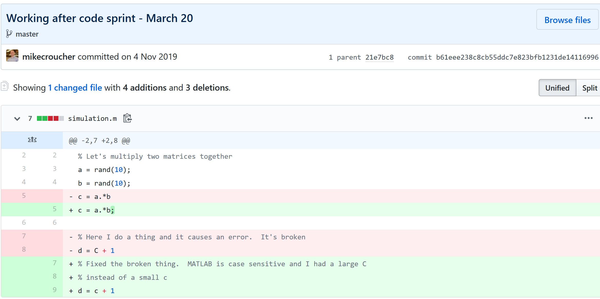

# Academic Benefits of using git and/or GitHub

Many people suggest that you should use version control as part of your scientifc workflow.  This is usually quickly followed up by recommendations to learn git and to put your project on GitHub.  Learning and doing all of this for the first time takes a lot of effort. Alongside all of  the recommendations to learn these technologies are horror stories telling how difficult it can be and memes saying that no one really knows what they are doing!  

There are a lot of reasons to **not** embrace the git but there are even more to go ahead and do it.  This is an attempt to convince you that it's all going to be worth it alongside a bunch of resources that make it easy to get started and academic papers discussing the issues that version control can help resolve.

This document will not address **how** to do version control but will instead try to answer the questions **what** you can do with it and  **why** you should bother.

# Improvements to individual workflow

Ways that git and GitHub can help your personal computational workflow -- even if your project is just one or two files and you are the only person working on it.

## Fixing filename hell

Is this a familiar sight in your working directory?

```
mycode.py
mycode_jane.py
mycode_ver1b.py
mycode_ver1c.py
mycode_ver1b_january.py
mycode_ver1b_january_BROKEN.py
mycode_ver1b_january_FIXED.py
mycode_ver1b_january_FIXED_for_supervisor.py
```

For many people, this is just the beginning.  For a project that has existed long enough there might be dozens or even hundreds of these simple scripts that somehow define all of part of your computational workflow.  Version control isn't being used because 'The code is just a simple script developed by one person' and yet this situation is already becoming the breeding ground for future problems.

* Which one of these files is the most up to date?
* Which one produced the results in your latest paper or report?
* Which one contains the new work that will lead to your next paper?
* Which ones contain deep flaws that should never be used as part of the research?
* Which ones contain possibly useful ideas that have since been removed from the most recent version?

Applying version control to this situation would lead you to a folder containing just one file

```
mycode.py
```

All of the other versions will still be available via the commit history.  Nothing is ever lost and you'll be able to effectively go back in time to any version of `mycode.py` you like.

## A single point of truth

I've even seen folders like the one above passed down generations of PhD students like some sort of family heirloom.  I've seen labs where multple such folders exist across a dozen machines, each one with a mixture of duplicated and unique files.  That is, not only is there a confusing mess of files in a folder but there is a confusing mess of these folders! 

This can even be true when only one person is working on a project.  Perhaps you have one version of your folder on your University HPC cluster, one on your home laptop and one on your work machine.  Perhaps you email zipped versions to yourself from time to time.  There are many everyday events that can lead to this state of affairs.

By using a GitHub repository you have a **single point of truth** for your project.  The latest version is there.  All old versions are there. All discussion about it is there. 

Everything...one place.

The power of this simple idea cannot be overstated.  Whenever you (or anyone else) wants to use or continue working on your project, it is always obvious where to go.  Never again will you waste several days work only to realise that you weren't working on the latest version.

## Keeping track of everything that changed

The latest version of your analysis or simulation is different from the previous one. Thanks to this, it may now give different results today compared to yesterday. Version control allows you to keep track of everything that changed between two versions.  Every line of code you added, deleted or changed is highlighted.  Combined with your commit messages where you explain why you made each set of changes, this forms a useful record of the evolution of your project.



It is possible to compare the differences between **any** two commits, not just two consecutive ones which allows you to track the evolution of your project over time.

## Always having a working version of your project

Ever noticed how your collaborator turns up unnanounced just as you are in the middle of hacking on your code.  They want you to show them your simulation running but right now its broken!  You frantically try some of the other files in your folder but none of them seem to be the version that was working last week when you sent the report that moved your collaborator to come to see you.

If you were using version control you could easily stash your current work, revert to the last good commit and show off your work.

## Tracking down what went wrong

You are always changing that script and you test it as much as you can but the fact is that the version from last year is giving correct results in some edge case while your current version is not.  There are 100 versions between the two and there's a lot of code in each version!  When did this edge case start to go wrong?

With git you can use [git bisect](https://neliosoftware.com/blog/git-bisect-to-find-faulty-commit/) to help you track down which commit started causing the problem which is the first step towards fixing it.

## Providing a back up of your project

Try this thought experiment:  Your laptop/PC has gone! Fire, theft, dead hard disk or crazy panda attack.


It, and all of it's contents have vanished forever.  How do you feel? What's running through your mind?
If you feel the icy cold fingers of dread crawling up your spine as you realise **Everything related to my PhD/project/life's work is lost** then you have made bad life choices.  In particular, you made a terrible choice when you neglected to take back ups.

Of course there are many ways to back up a project but if you are using the standard version control workflow, your code is automatically backed up as a matter of course.  You don't have to remember to back things up, back-ups happen as a natural result of your everyday way of doing things. 

## Making your project easier to find and install

There are dozens of ways to distribute your software to someone else.  You could (HORRORS!) email the latest version to a colleuage or you could have a .zip file on your web site and so on.  

Each of these methods has a small cognitive load for both recipient and sender.  You need to make sure that you remember to update that .zip file on your website and your user needs to find it. I don't want to talk about the email case, it makes me too sad.  If you and your collaborator are emailing code to each other, please stop. Think of the children! 

One great thing about using GitHub is that it is a standardised way of obtaining software.  When someone asks for your code, you send them the URL of the repo.  Assuming that the world is a better place and everyone knows how to use git, you don't need to do anything else since the repo URL is all they need to get your code.  a `git clone` later and they are in business.  

Additionally, you don't need to worry abut remembering to turn your working directory into a .zip file and uploading it to your website.  The code is naturally available for download as part of the standard workflow.  No extra thought needed! 

In addition to this, some popular computational environments now allow you to install packages directly from GitHub.  If, for example, you are following standard good practice for building an R package then a user can install it directly from your GitHub repo from within R using the `devtools::install_github()` function.

## Automatically run all of your tests

You've sipped of the KoolAid and you've been writing unit tests like a pro.  GitHub allows you to link your repo with something called [Continuous Integration (CI)](https://help.github.com/en/actions/automating-your-workflow-with-github-actions/about-continuous-integration) that helps maximise the utility of those tests.

Once its all set up the CI service runs every time you, or anyone else, makes a commit to your project. Every time the CI service runs, a virtual machine is created from scratch, your project is installed into it and all of your tests are run with any failures reported.  

This gives you increased confidence that everything is OK with your latest version and you can choose to only accept commits that do not break your testing framework.

# Collaboration and Community

How git and GitHub can make it easier to collaborate with others on computational projects.

## Control exactly who can see your work

'I don't want to use GitHub because I want to keep my project private' is a common reason given to me for not using the service.  The ability to create private repositories has been free for some time now (Price plans are available here https://github.com/pricing) and you can have up to 3 collaborators on any of your private repos before you need to start paying.  This is probably enough for most small academic projects. 

This means that you can control exactly who sees your code.  In the early stages it can be just you. At some point you let a couple of trusted collaborators in and when the time is right you can make the repo public so everyone can enjoy and use your work alongside the paper(s) it supports.

## Faciliate discussion about your work

Every GitHub repo comes with an [Issues section](https://guides.github.com/features/issues/) which is effectively a discussion forum for the project.  You can use it to keep track of your project To-Do list, bugs, documentation discussions and so on.  The issues log can also be integrated with your commit history.  This allows you to do things like `git commit -m "Improve the foo algorithm according to the discussion in #34"` where #34 refers to the Issue discussion where your collaborator pointed out

## Allow others to contribute to your work

You have absolute control over external contributions!  No one can make any modifications to your project without your explicit say-so. 

I start with the above statement because I've found that when explaining how easy it is to collaborate on GitHub, the first question is almost always 'How do I keep control of all of this?'

What happens is that anyone can 'fork' your project into their account.  That is, they have an independent copy of your work that is clearly linked back to your original.  They can happily work away on their copy as much as they like -- with no involvement from you.  If and when they want to suggest that some of their modifications should go into your original version, they make a 'Pull **Request**'.  
I emphasised the word 'Request' because that's exactly what it is.  You can completely ignore it if you want and your project will remain unchanged.  Alternatively you might choose to discuss it with the contributor and make modifications of your own before accepting it.  At the other end of the spectrum you might simply say 'looks cool' and accept it immediately.  

Congratulations, you've just found a contributing collaborator.

# Reproducible research

How git and GitHub can contribute to improved reproducible research.

## Making your software citable

Most modern research cannot be done without some software element.  Even if all you did was run a simple statistical test on 20 small samples, your paper has a data and software dependency.  Organisations such as the [Software Sustainability Institute](https://www.software.ac.uk/) and the [UK Research Software Engineering Association](https://rse.ac.uk/) (among many others) have been arguing for many years that such software and data dependencies should be part of the scholarly record alongside the papers that discuss them.  That is, they should be archived and referenced with a permanent Digital Object Identifier (DOI).

Once your code is in GitHub, it is straightforward to archive the version that goes with your latest paper and get it its own DOI using services such as [Zenodo](https://zenodo.org/).  Your University may also have its own archival system.  For example, The University of Sheffield in the UK has built a system called [ORDA](https://www.sheffield.ac.uk/library/rdm/orda) which is based on an institutional Figshare instance which allows Sheffield academics to deposit code and data for long term archival.

## Which version gave these results?

## Building a computational environment based on your repo

## Complying with funding and journal guidelines

# Further Resources

**Graphical User Interfaces to git**

PLACEHOLDER FOR GIT DESKTOP, GIT KRACKEN AND ALL THAT JAZZ

**Further discussions from scientific computing practitioners that discuss using version control as part of a healthy approach to scientific computing**

* [Good Enough Practices in Scientific Computing](https://journals.plos.org/ploscompbiol/article?id=10.1371/journal.pcbi.1005510) - 
* [Is Your Research Software Correct?](https://mikecroucher.github.io/MLPM_talk/) - A presentation from Mike Croucher discussing what can go wrong in computational research and what practices can be adopted to do help us do better
* [The Turing Way](https://www.turing.ac.uk/research/research-projects/turing-way-handbook-reproducible-data-science) A handbook of good practice in data science brought to you from the Alan Turning Institute
* [A guide to reproducible code in ecology and evolution](https://www.britishecologicalsociety.org/wp-content/uploads/2017/12/guide-to-reproducible-code.pdf) - A handbook from the British Ecological Society that discusses version control as part of general good practice

**Learning version control**

Convinced? Want to start learning?  Let's begin!

* [Git lesson from Software Carpentry](https://swcarpentry.github.io/git-novice/) - A free, community written tutorial on the basics of git version control


